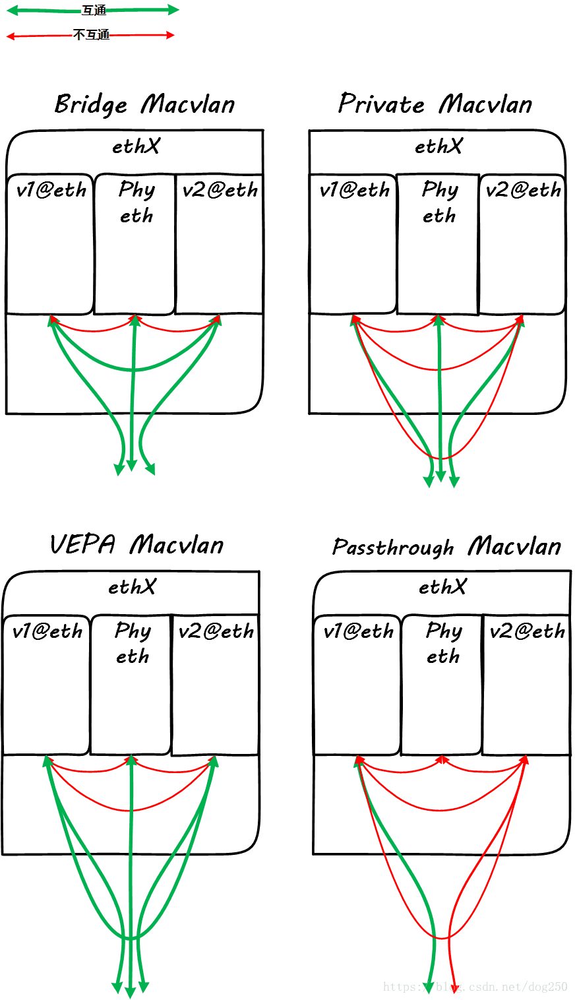

# macvlan

## macvlan 是什么

macvlan 是 Linux 引入的一种虚拟网卡，让用户在一块物理网卡上可以创建若干个依附于它的虚拟网卡，这些虚拟网卡拥有不同的 MAC 地址，实现网卡虚拟化

macvlan 可以解决`虚拟机之间`和`容器之间`的网络通信问题

## veth + bridge VS macvlan

假设一台宿主机上存在两个容器，分属不同 namespace，容器间通信可以怎么做？

一种方案是：创建两对 veth pair 和一个 bridge，将每对 veth pair 一端连接容器，一端连接 bridge，这样 bridge 起到报文中转的作用

macvlan 可以直接在容器内创建依附于物理网卡的虚拟网卡

## macvlan 的模式

| 模式 | bridge | VEPA | private | passthrough |
| - | :-: | :-: | :-: | :-: |
| 虚拟网卡间直接通信 | Yes | No | No | No |
| 与宿主机直接通信 | No | No | No | No |
| 通过外部（Hairpin）交换机通信 | | 虚拟网卡与物理网卡皆可 | No | 独占物理物理网卡 |
