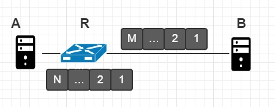
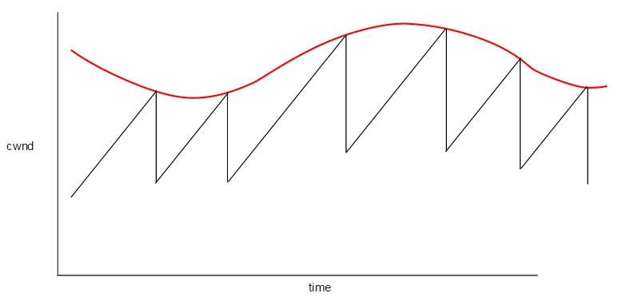
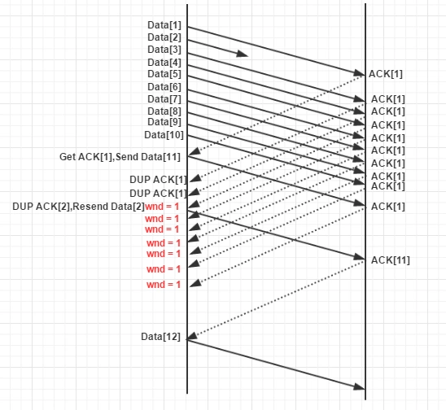
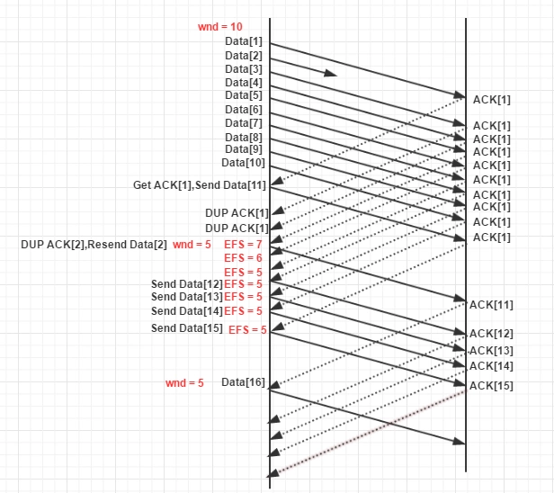

# TCP 拥塞控制之基础

## TCP 设计初衷

1. 建立连接
2. 传输链路可靠
3. 数据保证完整
4. 端到端流量控制

TCP 实现所有数据的可靠传输的核心原理是，对于从 A 端发送到 B 端的数据，B 端会发送回一个 ACK（Acknowledgement）信息给 A 端来告知自己收到了对应的信息。

另外还值得注意的是，TCP 工作在 IP 协议之上，IP 协议最多允许在一个包中包含 1500 个字节的数据，因此要发送 100kb 的数据，需要拆分成多个分段。根据 TCP 协议，每个分段都会收到对应的 ACK。

如果发送者没有收到一个数据分段的ACK，其会重新发送这个分段。

## 为什么进行拥塞控制

什么时候出现拥塞

TCP 作为传输层协议，不关心物理链路。现实网络中，TCP 连接的两端可能经过多个设备，但是*交换设备的性能有限*，当转发速率达到上限，报文进入缓存队列。当队列塞满后，TCP 被丢弃，超时丢包。

网络资源是各个 TCP 连接共享的，为了大家都能完成数据传输。所以，TCP 需要在它感知到传输发生拥塞时，_降低发送速率_，等待拥塞解除。

## 如何进行拥塞控制

TCP 是发送端进行拥塞控制的

TCP 为每个连接准备了记录拥塞窗口大小的变量 cwnd

cwnd 限制发送端 TCP 可以发送的最大报文数量（也受接收端通告的窗口大小限制），这个值越大，连接的吞吐量越大，也更容易导致网络拥塞

TCP 拥塞控制本质上是根据丢包情况调整 cwnd，使传输的吞吐率尽可能大

拥塞控制算法就是调整 cwnd 的方式

> Linux 查询命令 ss --tcp --info // 连接的 cwnd 值

## 拥塞控制算法

最初的两个算法 TCP Tahoe(1988) and TCP Reno(1990)

- Tahoe - 慢启动 》拥塞避免 》快速重传
- Reno - 在 Tahoe 上增加 》快速恢复

Tahoe 算法的基本思想

- 设置初始窗口值

- 当没有出现丢包时，慢慢增加窗口大小，逐渐逼近最大窗口大小（吞吐量上限）

- 当出现丢包，快速减小窗口大小，等待拥塞消除

## Tahoe 慢启动（slow start）

Tahoe 需要设定 cwnd 的初始值，但发送端不知道 cwnd 多大才合适，只能从 1 开始，如果此时开始加性增，增速太慢。因此使用称为慢启动的算法快速提高 cwnd。每发送一整窗的数据，cwnd = 2 x cwnd，即每收到 1 个 ACK， cwnd = cwnd + 1

当 cwnd 增加到 慢启动阈值（slow-start threshold）后，慢启动阶段结束，进入拥塞避免阶段

sshthresh 初始值非常大，当出现丢包后，慢启动阈值将被设为 cwnd / 2。同时 cwnd 被设为 1，重新开启慢启动过程。

## Tahoe 拥塞避免（congestion-avoidance）

Tahoe 采用加性增（additive increase）and 乘性减（multiplicative decrease），控制拥塞窗口的缓慢增加和快速减小

发送端发送数据（每一轮传输）：

- 没有丢包，则 cwnd = cwnd + 1

- 出现丢包，则 cwnd = cwnd / 2

为什么丢包后是 / 2 来减小窗口

物理链路有传输容量（transit capacity）和延时

假设交换设备 R 的传输容量是 M，缓存队列容量是 N

当 cwnd 小于 M 时，不会发生拥塞。当 cwnd 继续增大至超过 M 时，此时发生拥塞，报文进入缓存队列，但发送端 A 无法感知

当 cwnd 继续增大至超过 M + N 时，报文数量溢出，出现丢包

理想情况：当 cwnd 减小至 M 大小时，拥塞解除

现实情况：A 不知道交换设备 R 的 M 和 N，于是假设 M = N，所以 cwnd = 2M 时是丢包的零界点，为了快速解除拥塞，让 cwnd = cwnd / 2 = M

cwnd 的变化趋势曲线像下图，红色表示出现丢包，这种稳定状态成为拥塞避免阶段

现实网络应用中，拥塞避免阶段的 cwnd 是在收到每个 ACK（Acknowledgement）（报文到达确认）时更新： cwnd += 1 / cwnd，比每一轮传输后 cwnd += 1 略小

## Tahoe 快速重传（fast retransmit）

TCP 发送端有两种方法来检测丢包：

1. 发送端超时，发送端为每个包设置超时，超过时限未收到 ACK，则视为丢包

2. 接收端发送重复的 ACK，例如收到 1，2，3 后，有收到 5，接收端会再次回复 3 的 ACK。此时发送端会检测到重复的 ACK，认为发生丢包。 称为快速重传，不需要等待传输超时

现实网络环境，TCP 报文在接收端是乱序到达，甚至部分丢包。

例如：Data[1]、Data[2] ..... Data[8]，中途 Data[2]丢失，接收端只收到其余 7 个，此时接收端回复多次 ACK[1]（请求发送端发送 Data[2]）。

此时快速重传的策略，当发送端收到第 3 个重复的 ACK[1]（第 4 个 ACK[1]）时，马上重传 Data[2]，进入慢启动，设置 sshthresh = cwnd / 2， cwnd = 1

## Tahoe 的目的与缺陷

为什么Tahoe如此工作

不断增加拥塞窗口，为了适应变换的网络环境。例如同一个链路上发送端的增减会影响每个发送端的可用宽带

问题

- 高速网络中，需要很长时间才能有效利用可用带宽

- 发生丢包不一定意味着拥塞，例如 WiFi 信道，本身就可能发生丢包

- 拥塞后丢包，此时调整拥塞窗口太晚

## Reno 快速恢复（fast recovery）

在快速重传中，报文出现乱序丢包后，cwnd 变为 1，在丢失的数据包被应答前，无法发送新的数据。

快速恢复的策略，收到第 3 个重复的 ACK 后，快速重传丢失的包，然后

- 设置 cwnd = 当前 cwnd / 2，不设为 1

- 设置 sshthresh = 当前 cwnd / 2

EFS 发送端认为正在向接收端发送的报文数

一般情况，EFS = cwnd = N

快速恢复时，收到 3 个重复的 ACK（不占用网络资源）， EFS = N - 3，此时必定有 1 个丢包，所以 EFS = N - 4，然后发送端会快速重发报文， EFS = N - 3。当 EFS < cwnd 时，会发送新的报文，使得 EFS = cwnd

## New Reno

解决之前快速恢复只知道第一个被丢弃的报文。

引入新的变量 recover，当进入快速恢复时，收到重复的 ACK，将 recover 设置为已经发送的最后报文的序号。如果之后收到的新的 ACK 需要不超过 recover，说明还是同一个丢包引起的。
