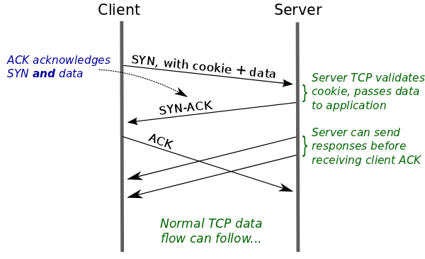

# TCP Fast Open



## 源起

影响网络速度的两个因素

```text
- 传输时延（transmission delay）
  将报文灌入网络电缆的时间，带宽连接有关，比如千兆网络比百兆网络TD小

- 传播时延（propagation delay）
  电信号在网络中端到端的时延，跟距离有关
```

TCP 不能减少上面任何一种 delay，只能让通信更有效率

当前网络背景

- TCP 流量大部分是短连接，数据报文不多

- 三次握手和四次挥手的控制报文不带数据，浪费流量

- 出于安全考虑，TCP 默认实现不会在 SYN 报文中携带用户数据

## 原理

Server 为首次发起连接的 Client（以源 IP 区分）发放专属的通行证（根据 IP 生成的 Cookie），之后 Client 向 Server 发起 TCP 连接，在 SYN 报文中带上 Cookie 和用户数据，经 Server 验证通过后，就可以直接上送给应用

### 首次连接建立

1. Client 向 Server 发送 SYN 报文，并带上 Cookie 为空的 TCP 选项，表示希望使用 TFO，请求通行证（Cookie）

2. 开启 TFO 功能的 Server 收到该 SYN 报文后，生成 Cookie，通过 SYNACK 报文的选项字段传回

3. Client 收到 SYNACK 报文后，缓存 Cookie

### 后续连接建立

1. Client 再次发起请求，在 SYN 报文中携带缓存的 Cookie 和 数据，发送给 Server

2. Server 收到 SYN 报文后，验证 Cookie 通过，将数据上送给应用。`此时可能三次握手没有完成，TCP 处于 SYN_RCVD 状态`

### Cookie 格式

Cookie 通过 TCP 选项在两端交互，值由 Server 根据 <ClientIP、ServerIP> 生成。与 TCP 端口号无关，是主机级别的
