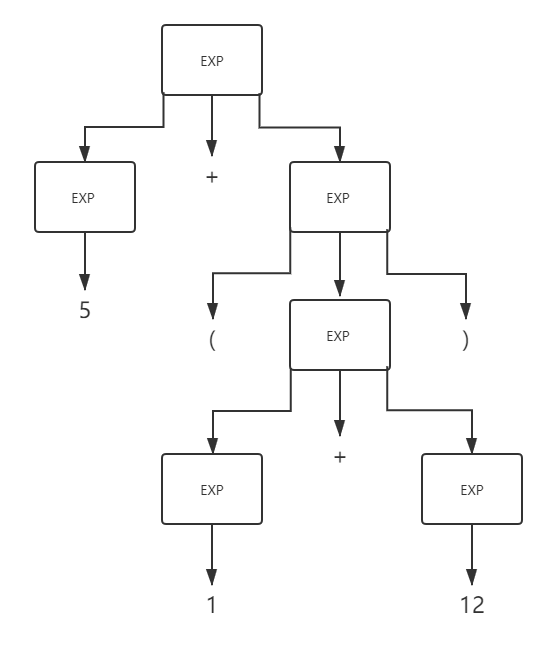
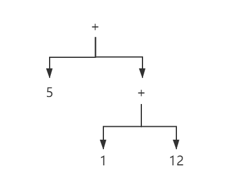

# Abstract Syntax Tree

## What's the AST

`Abstract Syntax Tree(AST)` 是解析树（parse tree）的精简版本。

## AST 是什么

`Abstract Syntax Tree(AST)` 是解析树（parse tree）的精简版本。

```text
解析树 = Parse Tree = CST
抽象语法树 = Syntax Tree = AST
```

## 编译器工作过程

JS 示例：`5 + (1 x 12)`

### 词法分析

1. 扫描源代码文本，**scanner** 从左到右扫描文本，折成多个单词

2. 将单词传入**分词器**，经过一系列识别器（关键字识别器、标识符识别器、常量识别器、操作符识别器等），确定单词的词性，生成 token 序列

```text
  token 一般用 <type, value> 形似的二元组表示，type 表示单词种类，value 表示属性值
  例如 <CONST, 5> <OPT, +> <SLP, -> <CONST, 1> <OPT, *> <CONST, 12> <RLP, ->
```

scanner 和分词器的工作，构成编译器的词法分析阶段

### 语法分析

1. token 序列经过解析器，识别出各类短语

2. 根据**文法规则**输出为解析树

```text
// Little girl ate apple

<句子> -> <名词短语><动词短语>

<名词短语> -> <形容词><名词>

<动词短语> -> <动词> <名词短语>

<形容词> -> little

<名词> -> girl | apple

<动词> -> ate

用<>包裹起来的部分称为语法规则，未用<>包括起来的部分(如little、girl等)，就是语言的基本符号

```



总结：

* 解析树的根节点是文法开始符号

* 内部节点表示一个产生式的应用

* 从左到有的叶节点得到这棵树的产出（yield）

### 精简解析树

1. 隐藏单继承节点，如 EXP -> 5

2. 隐藏括号在树结构中

3. 用操作符替换内部节点

得到的新的 AST



与解析树的不同

* AST 不包含语法细节，如冒号、括号、分号

* AST 会压缩单继承节点

* 操作符变成内部节点，不会以叶节点出现在树的末端

### 代码描述

示例：var result  =  5 + (1 * 12)

```json
// 词法分析生成的 token

[
  {
    "type": "Keyword",
    "value": "var"
  },
  {
    "type": "Identifier",
    "value": "result"
  },
  {
    "type": "Punctuator",
    "value": "="
  },
  {
    "type": "Numeric",
    "value": "5"
  },
  {
    "type": "Punctuator",
    "value": "+"
  },
  {
    "type": "Punctuator",
    "value": "("
  },
  {
    "type": "Numeric",
    "value": "1"
  },
  {
    "type": "Punctuator",
    "value": "*"
  },
  {
    "type": "Numeric",
    "value": "12"
  },
  {
    "type": "Punctuator",
    "value": ")"
  },
  {
    "type": "Punctuator",
    "value": ";"
  }
]

// AST

{
  "type": "Program",
  "body": [
    {
      "type": "VariableDeclaration",
      "declarations": [
          {
              "type": "VariableDeclarator",
              "id": {
                  "type": "Identifier",
                  "name": "result"
              },
              "init": {
                  "type": "BinaryExpression",
                  "operator": "+",
                  "left": {
                      "type": "Literal",
                      "value": 5,
                      "raw": "5"
                  },
                  "right": {
                      "type": "BinaryExpression",
                      "operator": "*",
                      "left": {
                          "type": "Literal",
                          "value": 1,
                          "raw": "1"
                      },
                      "right": {
                          "type": "Literal",
                          "value": 12,
                          "raw": "12"
                      }
                  }
              }
          }
      ],
      "kind": "var"
    }
  ],
  "sourceType": "script"
}

```
