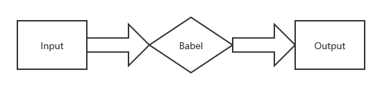
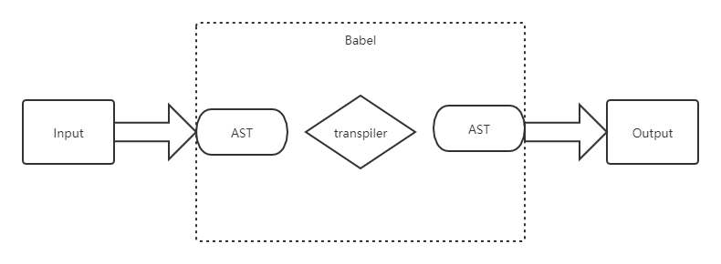

# Babel

## Babel 是什么

> [Babel](https://babeljs.io/) 是一个 JavaScript 编译器

作为 JS 编译器，Babel 接收输入的 JS 代码，经过内部一系列处理后，最终输出修改后的 JS 代码

在 Babel 内部，会执行下列步骤：

1. 将 Input 解析为 [AST](./ast.md)（抽象语法树）

2. 转换 AST

3. 将编辑后的 AST 输出为 Output

以上三个能力由 babel-core 提供

- babel-parser 实现第一步

- babel-generator 实现第三步

